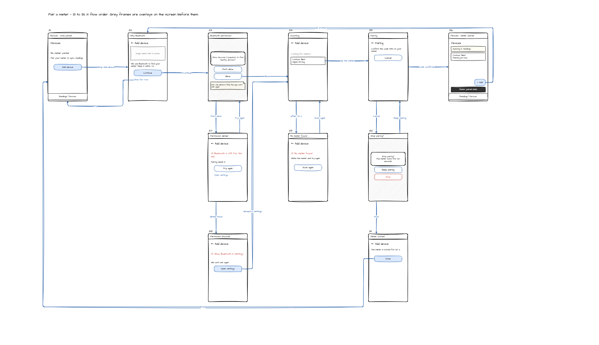
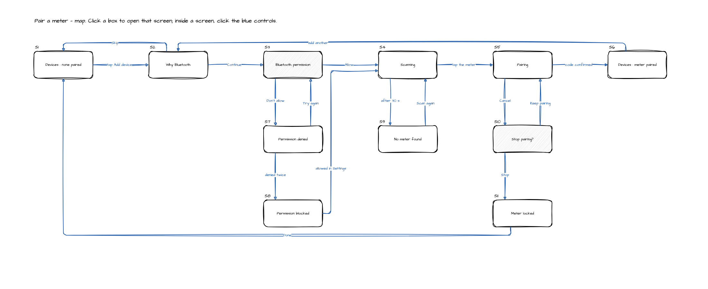
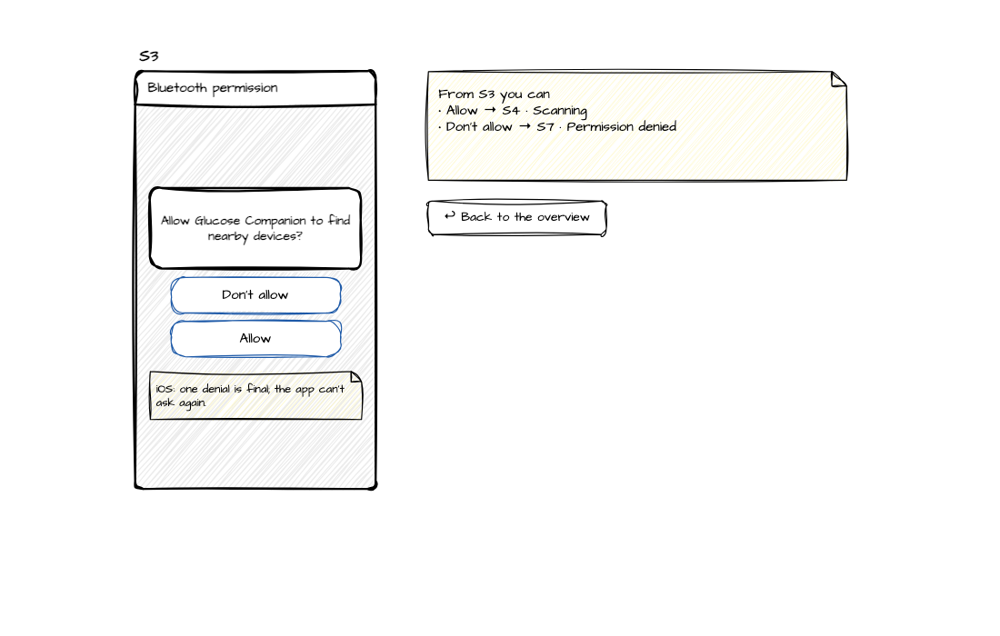
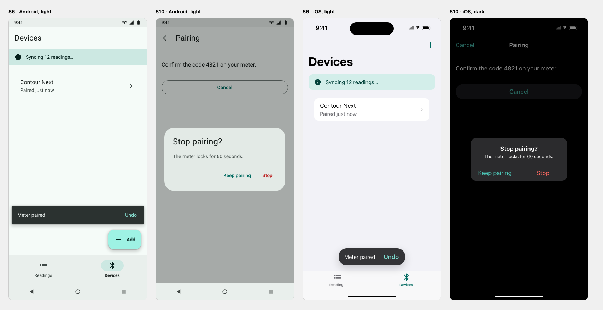

# Mobile Prototyper

An agent skill that turns your **spec, architecture and design documents** into a **rough
draw.io prototype of a native mobile app — Android, iOS or both**: numbered screens, their states
and branches, and the arrows between them. It works with you like a UX designer would, and keeps
the prototype rough on purpose, so the discussion stays on features and flow, not on colours and
spacing.

```
Idea / PRD → clarify flow and decisions → rough screens + state branches → lock the flow
           → optional: design system + final-look screens → handoff
```

- It finds which documents you have, and **proposes the answers they already contain for your approval**.
- It **asks you only what's left**: conflicts between documents and gaps that change the experience,
  a few questions at a time, each with a recommendation.
- It **draws the flow as an editable `.drawio` file** in a hand-drawn style. You choose how:
  - **Wireflow**: every screen and arrow on one page per journey. Read the whole flow at a glance.
  - **Click-through**: a small map, then one page per screen; clicking a button jumps to the
    screen it leads to.
  - **Both** in one file.
- Every screen state carries a **number in flow order** (S1, S2, …), written above its frame
  and used everywhere a screen is mentioned: in chat, in the notes, on the final-look screens
  and in the handoff.
- The drawing is **untangled, or it isn't drawn**: no two arrows overlap or cross, no arrow runs
  over a screen, and every arrow label sits clear of screens, arrows and other labels.
- The file opens in draw.io Desktop, the draw.io extension for VS Code, or app.diagrams.net. Edit
  it by hand if you like: the skill won't overwrite your edits, and carries them back into the
  flow.
- **First how it works, then how it looks.** Once you lock the flow, it offers an optional
  **design phase**: two directions as style tiles, a Material 3 colour scheme and an iOS tint
  with every text colour checked for contrast, and every screen of your flow rendered in the
  final Android and iOS look.
- It stops at a locked flow (and optionally an approved look) and a **handoff package** for
  native implementation, with component mappings for Material 3 (Compose) and SwiftUI.

It does not build a clickable web app, and it does not write Compose, SwiftUI, Kotlin or Swift.

Works with **Claude Code**, **Codex**, and any agent that reads `SKILL.md` folders (the open Agent
Skills format).

## What you get

These pictures are the skill's own output for one example, *Pair a meter* from a glucose
companion app: 11 screen states and 17 arrows. The files are in
[`docs/examples/pair-a-meter/`](docs/examples/pair-a-meter/): the flow as data
([`flow.json`](docs/examples/pair-a-meter/flow.json)) and the two diagrams generated from it,
which you can open in draw.io.

**Wireflow**: the whole journey on one page. The main path runs left to right (S1 to S6);
branches such as "permission denied" hang under the screen they interrupt. Grey frames are
overlays (a dialog or a system prompt) on the screen before them.



**Click-through**: the same flow as a small map. Clicking a box opens that screen's page.



On a screen's page, the blue controls jump to the screen they lead to, and a note lists where
you can go from here.



**Final-look screens** (optional design phase): the same numbered screens in Material 3 and in
the iOS system look, in light and dark.



To regenerate the diagrams from the example flow:

```bash
node skills/mobile-prototype/scripts/sketch.mjs --spec docs/examples/pair-a-meter/flow.json --out docs/examples/pair-a-meter/wireflow.drawio --style wireflow
```

```
Spec · Architecture · Design · API docs
                │
   0 Setup: draw.io MCP server present? (offer to configure it; never blocks)
   1 Discover inputs + platforms ──► you choose the prototype folder (recommended: docs/prototypes)
                                     and confirm the availability table
   2 Answer from the documents ────► you approve / correct the proposals,  (gate A)
                                     and choose wireflow / click-through / both
   3 Ask what's left, ≤ 4 at a time ► you answer                           (gate B)
   4 Sketch the flow in draw.io ───► you lock the flow                     (gate C)
   5 Optional design phase, only if you want one:
       two directions as style tiles ► you pick                            (gate D1)
       theme + contrast check, final-look screens ► you approve the look   (gate D2)
   6 HANDOFF.md → stop (no Compose or SwiftUI code)
```

The skill pauses at each gate and does nothing ahead of your approval. Every pause ends with a
short reading guide: which files were created, which ones you need to read now and in what
order, and which are only for reference or for the agent. The same guide is kept in
`docs/prototypes/README.md`, so it's the one file to open first. At gate A, for example, you only need
the proposals table in the chat; the notes behind it are optional.

## How the sketch is made

The agent writes the flow once, as data, in `docs/prototypes/flow.json`: journeys, one frame per screen
state, and one labelled transition per arrow. A script turns that into the diagram:

```bash
node skills/mobile-prototype/scripts/sketch.mjs --style wireflow --open
```

The script does the numbering, the layout, the arrow routes and the label placement, so two runs
of the same flow give the same picture:

- Each arrow goes straight to the next screen, or straight down to a branch, where it can.
  Otherwise the script tries the routes it knows (around the side, along a lane between the
  rows, the long way round the page) and keeps a set in which no two arrows overlap or cross
  and none runs over a screen.
- Each label is wrapped and moved along its arrow until it is clear of everything else.
- An arrow starts at the control that triggers it. When no clean route exists from there, it
  starts at the frame's edge instead.
- If the layout allows no such drawing, the script names the arrows or the label in the way and
  writes nothing. The agent then changes the layout in `flow.json` (moves a screen, shortens a
  label or splits the journey) and never shows a sketch that didn't pass.
- It doesn't overwrite a diagram you edited by hand: the agent carries your edits into
  `flow.json` first, and your version is kept as a `.bak`.

The same `flow.json` later feeds the design phase, so the final-look screens always match the
locked flow.

## Optional design phase

The sketch is deliberately plain, so reviews focus on the flow. After you lock the flow, the skill
offers a design pass in one line; say no and you get the handoff straight away.

- **Input**: the locked `flow.json`. The design phase changes how screens look, never the flow.
- **Two levels**: a *visual direction* (lives in `docs/prototypes/`, disposable) or a *design system*
  (`design-system/<app>/` in your project, with `material-theme.json` and `ios-theme.json` for the
  native team, and per-screen notes where a screen differs).
- **Three plain choices**: density (spacious / balanced / dense), expressiveness (restrained /
  balanced / bold) and motion (minimal / standard), proposed from your documents.
- **A fixed contract**: every direction is written into `DESIGN.md`. `theme.mjs` then derives
  the tokens: Android colours come from Google's
  [Material Color Utilities](https://github.com/material-foundation/material-color-utilities)
  (Apache-2.0, downloaded once on first use; an offline approximation is used, and flagged, when
  it can't be). On iOS the brand becomes the tint and the system colours stay. It refuses to
  write a theme with any text colour below 4.5:1, and suggests the nearest colour that passes.
- **Style tiles**: each direction is shown in Android and iOS device shells: palette with
  contrast ratios, type scale and every component, in light and dark.
- **Final-look screens**: `docs/prototypes/look/screens.html` shows every screen state of your flow,
  with the same S-numbers as the sketch, in Material 3 and in the iOS system look, in light and
  dark and at larger text sizes. The page checks each screen (touch-target size, overflow,
  cut-off text, contrast) and shows the result. They are pictures of the look, not a working app.
- **WCAG AA or AAA**: `contrast: high` targets 7:1 for text on both platforms, and the screens
  are checked against it.

### Design provider: ui-ux-pro-max (optional)

Directions are filled by a *provider*. When you first choose the design phase, the skill
installs [**ui-ux-pro-max**](https://github.com/nextlevelbuilder/ui-ux-pro-max-skill) by
[Next Level Builder](https://github.com/nextlevelbuilder) (MIT): a searchable design dataset of
product categories, palettes, font pairings and UX rules. It tells you exactly what it installs
before it does:

```
Installing the design skill ui-ux-pro-max v2.15.0 (MIT, © 2024 Next Level Builder)
  From: github.com/nextlevelbuilder/ui-ux-pro-max-skill, release v2.15.0 (commit a38d04c), integrity-checked
  Into: ~/.claude/skills/ui-ux-pro-max — only this skill and its licence; the other skills in that repository are not installed
  Needs Python 3: found 3.12.4 (python3)
  It is a normal skill: your agent can also use it outside the prototype workflow.
  Remove it any time: node …/design-provider.mjs --remove --host claude (or delete that folder)
```

- Only that one skill folder is installed, at a pinned release checked against a SHA-512 hash;
  the upstream repository's other skills (including one that calls paid image APIs) are not.
- It needs Python 3. Without Python, or offline, nothing is installed and a **built-in provider**
  fills the same contract from your documents and the platform guidelines. The design phase
  never depends on it.
- Its output is web-leaning, so the skill uses its palette, font and mood reasoning and its UX
  rules, and drops landing-page patterns, hover effects, web shadows and GSAP animation. Our
  own `theme.mjs` still makes all the tokens and checks contrast.
- To install it up front: `node install.mjs --with-design`. To check or remove it:
  `node skills/mobile-prototype/scripts/design-provider.mjs --check` / `--remove --host <agent>`.
- It isn't part of this repository and keeps its own licence (in the installed folder).

## Requirements

- Node.js 18 or newer (for the helper scripts and the draw.io MCP server)
- An agent: Claude Code, Codex, or another Agent Skills–compatible agent
- Something to open a `.drawio` file: [draw.io Desktop](https://www.drawio.com), the draw.io
  extension for VS Code or Cursor, or a browser (app.diagrams.net; the skill can open a viewer
  link for you)
- The **draw.io MCP server** (`@drawio/mcp`) is installed by the plugin installs and configured
  by `install.mjs`. It adds tools that open a diagram in the draw.io editor. The skill works
  without it: it writes and opens the sketch itself
- Optional, for the design phase only: internet access the first time (Material Color Utilities,
  fonts, ui-ux-pro-max) and Python 3 for ui-ux-pro-max. Neither is needed for the sketch.

## Install


### Claude Code (plugin — bundles the draw.io MCP server)

```bash
claude plugin marketplace add AnilDeshpande/codetutor-mobile-prototyper
```

```bash
claude plugin install mobile-prototyper@codetutor
```

Or inside a Claude Code session: `/plugin marketplace add AnilDeshpande/codetutor-mobile-prototyper`, then
`/plugin install mobile-prototyper@codetutor`. Restart the session afterwards.

### Codex (plugin — bundles the draw.io MCP server)

```bash
codex plugin marketplace add https://github.com/AnilDeshpande/codetutor-mobile-prototyper.git
```

```bash
codex plugin add mobile-prototyper@codetutor
```

A local clone works too: `codex plugin marketplace add /path/to/codetutor-mobile-prototyper`.

### Any agent (skill folder + draw.io MCP configuration)

From a clone of this repository:

```bash
node install.mjs
```

It installs the skill for every agent it finds (Claude Code, Codex, Cursor, Gemini CLI) and
configures the draw.io MCP server for each, after showing what it will change. Options:

| Option | Effect |
|---|---|
| `--agent claude,codex` | only these agents (`claude`, `codex`, `cursor`, `gemini`, `agents`) |
| `--scope project` | install into the current project (`.claude/skills`, `.agents/skills`, …) instead of your home folder |
| `--dir <path>` | copy the skill into any other agent's skills folder |
| `--link` | symlink instead of copy (for working on the skill) |
| `--skip-mcp` | don't touch MCP configuration |
| `--with-design` | also install the optional design provider ui-ux-pro-max now (otherwise it's installed when you first choose the design phase) |
| `--dry-run` | show what would happen |

Without cloning: `npx github:AnilDeshpande/codetutor-mobile-prototyper -- --agent codex`.

With the open Agent Skills CLI, which knows the skill folders of many agents:

```bash
npx skills add AnilDeshpande/codetutor-mobile-prototyper --skill mobile-prototype
```

The draw.io MCP server is optional with this route (next section).

## draw.io MCP server

The official server from the draw.io team ([jgraph/drawio-mcp](https://github.com/jgraph/drawio-mcp))
opens a diagram in the draw.io editor from your agent. To check or configure it yourself:

```bash
node skills/mobile-prototype/scripts/check-drawio-mcp.mjs --smoke
```

```bash
node skills/mobile-prototype/scripts/check-drawio-mcp.mjs --configure --host claude
```

Hosts: `claude`, `codex`, `cursor`, `gemini`, `all`. Config files are backed up before they're
changed, and secrets in them are never printed. For other agents, add:

```json
{ "mcpServers": { "drawio": { "command": "npx", "args": ["-y", "@drawio/mcp"] } } }
```

MCP servers load when a session starts, so restart the agent after configuring. If the skill finds
the server missing mid-run, it asks before configuring and carries on either way. Diagrams don't
leave your machine through it: the server and the viewer link carry the diagram in the URL
fragment, which browsers don't send anywhere.

## Use

Put your documents anywhere in the project (for example `docs/` and `design/`), then ask:

> Sketch the device pairing onboarding from docs/PRD.md, docs/ARCHITECTURE.md and design/.

> Check which of my docs are available and start a mobile prototype for the readings list.

> Prototype the onboarding for both Android and iOS.

> Resume my mobile prototype.

Before it creates anything, the skill asks where the prototype files should go. It recommends
`docs/prototypes`; you can name any other folder inside your project. A path outside the project
is refused, so the files always travel with the repository. Everything the skill produces then
lives in that folder:

```
docs/prototypes/
├── README.md      start here: where things stand and what to read
├── flow.drawio    the sketch: numbered screens and the arrows between them
├── flow.json      the same flow as data (the agent edits this; the sketch is generated from it)
├── HANDOFF.md     for the native implementation
├── look/          only after a design pass: screens.html (final-look screens), style-tile.html
└── notes/         STATE, INPUTS, CLARIFICATIONS, DECISIONS, and DESIGN + THEME-REPORT after a design pass
```

To change the flow, tell the agent, or edit `flow.drawio` yourself and tell the agent what you
changed. To add shapes by hand in the same pencil style, duplicate an existing shape, or set the
draw.io VS Code extension's theme to `sketch`.

To look at the final-look screens after a design pass, run
`node skills/mobile-prototype/scripts/serve.mjs` (the path depends on where the skill is
installed) and open the `screens.html` link it prints.

## Repository layout

```
.claude-plugin/        Claude Code plugin + marketplace manifests
.codex-plugin/         Codex plugin manifest
.agents/plugins/       Codex marketplace manifest
.mcp.json              draw.io MCP server, bundled by both plugins
install.mjs            installer for any agent (skill + MCP configuration)
skills/mobile-prototype/
├── SKILL.md           the workflow
├── references/        intake, question bank, clarification protocol, the flow spec, sketch
│                      review, draw.io setup, platform conventions and visual language
│                      (platforms/android, platforms/ios), stops and the reading guide, design
│                      phase and providers, handoff
├── scripts/           discover-inputs, scaffold, sketch (flow.json → flow.drawio),
│                      check-drawio-mcp, and for the design phase: screens, theme,
│                      design-provider, serve
└── assets/            templates (reading guide, flow spec, notes, design, handoff) and, for the
                       design phase, the design kit (Android and iOS shells) and the style tile
evals/                 evals.json + a fixture project with a spec, architecture, ADR and design notes
```

## Evals

`evals/evals.json` describes eighteen cases: input discovery (with the platform suggestion),
proposals for approval with the sketch-style question, stopping at gate A with a reading guide,
surfacing a document conflict, a missing spec, a missing draw.io MCP server that doesn't block,
drawing the sketch from the flow spec, not overwriting a hand-edited diagram, an iOS target on an
Android-specific architecture, one sketch for both platforms, handoffs for one and two platforms,
the design phase being offered but not forced, falling back to the built-in provider without
Python, a brand colour that fails contrast, installing and using ui-ux-pro-max for a design
system, rendering the final-look screens, and a prompt that should *not* trigger the skill. They
run against `evals/fixtures/glucose-companion`, which contains a deliberate conflict between the
PRD and an architecture decision record.

`evals/trigger-evals.json` checks the skill's description on its own: ten prompts that should load
the skill and ten near misses that shouldn't (Compose or SwiftUI code, a clickable web prototype,
other draw.io diagrams, PRD reviews). Run it with skill-creator's `run_eval.py` whenever the
description changes, with `--num-workers 1`: parallel runs share one `.claude/commands` folder,
see each other's copies of the skill and get counted as misses.

## License

[MIT](LICENSE) © Anil Deshpande

Downloaded on demand, not included in this repository: the
[draw.io MCP server](https://github.com/jgraph/drawio-mcp) (Apache-2.0, © JGraph / draw.io AG),
[Material Color Utilities](https://github.com/material-foundation/material-color-utilities)
(Apache-2.0, © Google) for Android colour schemes, and
[ui-ux-pro-max](https://github.com/nextlevelbuilder/ui-ux-pro-max-skill) (MIT, © 2024 Next Level
Builder) as the optional design provider. Fonts chosen in a design direction come from Google
Fonts under their own open licences.
